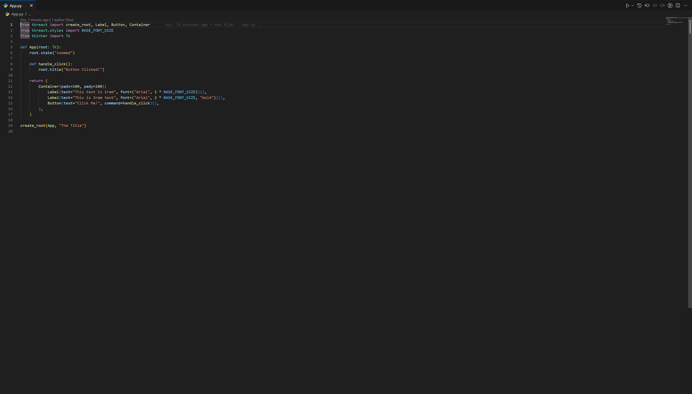
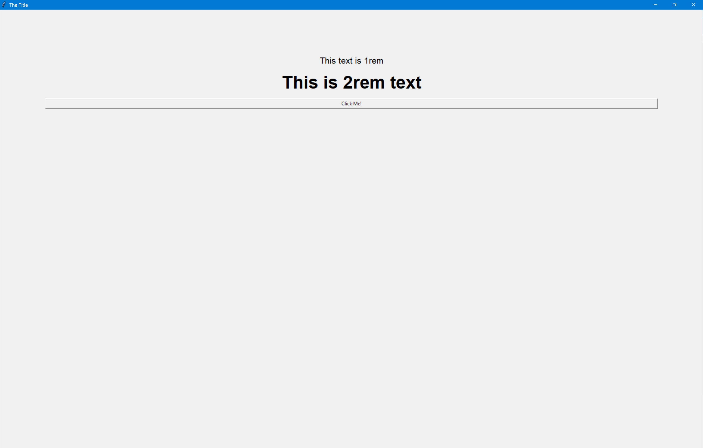

# TkReact
Broken as sh*t React port for Python (uses Tkinter for help). Don't expect TkReact to work well with commercial usage.
Replace `App.py` with your TkReact application entry file.
The folder `tkreact` is the actual package used in `App.py`.

## Features
- **Basic React-like UI rendering** with Python's Tkinter
- **Simple state management** using hooks, similar to React's `useState`
- **Custom components** for creating dynamic UIs in Python
- **Supports button and label components** with inline styles

## Installation

Clone this repository or download the project files:

```shell
git clone https://github.com/boyninja1555/TkReact.git
cd TkReact
```

Ensure you have the required dependencies:

```shell
pip install -r requirements.txt
```

## Usage

To run the application, simply run the Python script:

```shell
python App.py
```



You can customize the `App.py` file to build your own simple UI.

## Contributing

Feel free to submit bug reports, feature requests, or pull requests. Be warned, however, that this project is a **work in progress** and may break at any time.

## License

This project is licensed under the MIT License - see the [LICENSE](LICENSE.md) file for details.
